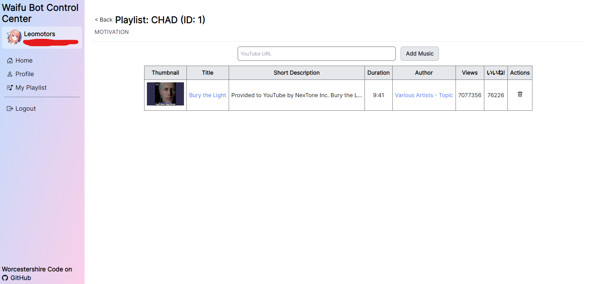

# Waifu Bot

Waifu Bot is the bot that is serving _our_ server

Current Waifu we SIMP: Bocchi-chan

**Current Version**: 4.0  
**Been SIMPing since**: 4.0.640

## 📚 Tech Stack

The most ~~over-engineered~~ advanced Discord Bot

## ✨ Features

- Mainly: Music from YouTube with power of [@leomotors/music-bot](https://github.com/Leomotors/music-bot#%EF%B8%8F-highlight) << some gallery there

- Personal Playlist for each user with website for them to edit

- Miscellanous ~~useless~~ features

- [Golden Frame](https://github.com/Leomotors/golden-frame)!

- Using Cocoa Discord Utils and 💛JavaScript💛

## 🐇 How to run the bot

### Prerequisites

- Your Discord Bot (of course)
- nodejs 16
- pnpm 7
- PostgreSQL Database (v13 Recommended) and Public Server (VM) for Website
- Tenor API Key (not required, it works even with invalid key lol)
- [golden-frame](https://github.com/Leomotors/golden-frame) (Installable via pip, required)

### Steps

- Fill in .env (see .env.example in each apps)
- `pnpm install`
- (in apps/server) `pnpm prisma migrate dev --skip-seed`
- `pnpm start` (Will start all apps at once, Turborepo will automatically build for you! If fail try again lol)

## Waifu Bot Archive

The Discord Bot (apps/bot) was built on top of [CarelessDev/harunon.js](https://github.com/CarelessDev/harunon.js)

Below are list of previous waifu we chose to SIMP

- **Version 4.0.605 - 4.0.629** Vergil [v4.0.629](https://github.com/leomotors/waifu-bot/tree/v4.0.629) <August 2022 - ~~No Nut~~ November 2022>

- **Version 3.2 - 4.0.600** 式守さん (Shikimori-san) [v3.2](https://github.com/leomotors/waifu-bot/tree/v3.2) | [v4.0.600](https://github.com/leomotors/waifu-bot/tree/v4.0.600) <July 2022 - August 2022>

- **Version 3.0 - 3.1** 雪ノ下陽乃 (Yukinoshita Haruno) [Repository](https://github.com/CarelessDev/harunon.js) <Mar 2022 - July 2022>

- **Version 2.0** 雪ノ下陽乃 (Yukinoshita Haruno) But it was in Python [Repository](https://github.com/CarelessDev/Harunon) <November 2021 - Mar 2022>

- **Version 1.0** Skittle Chan [Repository](https://github.com/CarelessDev/SIMP-Bot) <Sep 2021 - November 2021>

## Technical Version History

Version 1 -> Python Skittle-chan Era  
Version 2 -> Python Harunon Era  
Version 3 -> JavaScript  
Version 4 -> Full Stack Waifu with T U R B O R E P O

## Utility Library behind this Bot!

[Cocoa Discord Utils](https://github.com/Leomotors/cocoa-discord-utils) by @Leomotors

**Made with 💛💛💛**

## 🖼️ Gallery

(at Version: 4.0.600)

### Client

### Bot

(at version 4.0.605)

