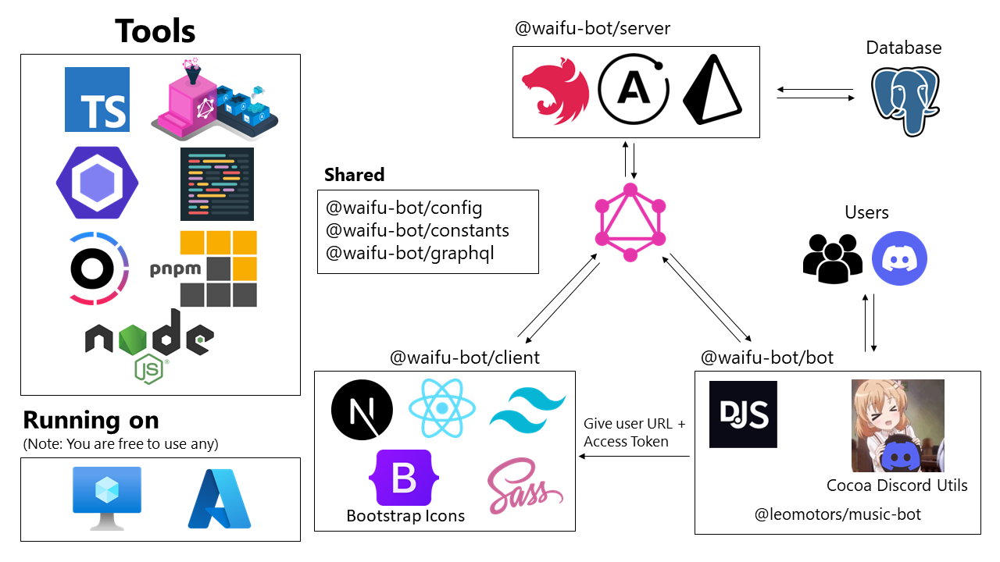

# Waifu Bot

Waifu Bot is the bot that is serving _our_ server

Current Waifu we SIMP: <ruby>宵崎奏<rt>Yoisaki Kanade</rt></ruby>

Nominated and image selected by @Qwenty228

**Current Version**: 5.2  
**Been SIMPing since**: 5.2.820

## 📚 Tech Stack

Coming soon

Old tech stack

My 2023 reaction: เลอะเทอะ

The most ~~over-engineered~~ advanced Discord Bot

## ✨ Features

- Mainly: Music from YouTube with power of [@cocoa-discord/music-module](https://github.com/Leomotors/cocoa-discord/blob/main/packages/music-module/README.md#%EF%B8%8F-highlight) << some gallery there

- Personal Playlist for each user with website for them to edit

- Miscellanous ~~useless~~ features

- [Golden Frame](https://github.com/Leomotors/golden-frame)!

- Using Cocoa Discord and 💛JavaScript💛

## 🐇 How to run the bot

### Prerequisites

- Your Discord Bot (of course)
- nodejs 18 (1s1)
- pnpm 8
- ~~PostgreSQL Database and Public Server (VM) for Website~~ not yet but might be soon
- Tenor API Key
- [Golden Frame Server](https://github.com/Leomotors/golden-frame) deployed somewhere

### Steps

- Fill in .env (see .env.example in each apps)
- `pnpm install`
- `pnpm build`
- `pnpm start`

### Or via Docker

`docker pull ghcr.io/leomotors/waifu-bot:latest`

## Waifu Bot Archive

The Discord Bot (apps/bot) was built on top of [CarelessDev/harunon.js](https://github.com/CarelessDev/harunon.js)

Below are list of previous waifu we chose to SIMP

- **Version 4.1.700 - 5.1.810** Kaede [v5.1.810](https://github.com/Leomotors/waifu-bot/tree/5.1.810) &lt;September 2023 - October 2023 (2ヶ月)&gt;

- **Version 4.0.640 - 4.0.662** Bocchi [v4.0.662-bocchi](https://github.com/Leomotors/waifu-bot/tree/v4.0.662-bocchi) &lt;November 2022 - September 2023 (11ヶ月)&gt;

- **Version 4.0.605 - 4.0.629** Vergil [v4.0.629](https://github.com/leomotors/waifu-bot/tree/v4.0.629) &lt;August 2022 - ~~No Nut~~ November 2022 (4ヶ月)&gt;

- **Version 3.2 - 4.0.600** 式守さん (Shikimori-san) [v3.2](https://github.com/leomotors/waifu-bot/tree/v3.2) | [v4.0.600](https://github.com/leomotors/waifu-bot/tree/v4.0.600) &lt;July 2022 - August 2022 (2ヶ月)&gt;

- **Version 3.0 - 3.1** 雪ノ下陽乃 (Yukinoshita Haruno) [Repository](https://github.com/CarelessDev/harunon.js) &lt;Mar 2022 - July 2022 (5ヶ月)&gt;

- **Version 2.0** 雪ノ下陽乃 (Yukinoshita Haruno) But it was in Python [Repository](https://github.com/CarelessDev/Harunon) &lt;November 2021 - Mar 2022 (5ヶ月)&gt;

- **Version 1.0** Skittle Chan [Repository](https://github.com/CarelessDev/SIMP-Bot) &lt;Sep 2021 - November 2021 (3ヶ月)&gt;

## Technical Version History

Version 1 -> Python Skittle-chan Era  
Version 2 -> Python Harunon Era  
Version 3 -> JavaScript  
Version 4 -> Full Stack Waifu with Turborepo

> _Version 4.1 -> Removed full stack website_

Version 5 -> Only Bot (will add website in Version 6)

## Utility Library behind this Bot!

[Cocoa Discord](https://github.com/Leomotors/cocoa-discord) by @Leomotors

**Made with 💛💛💛**

## 🖼️ Gallery

(at version 4.0.605)

