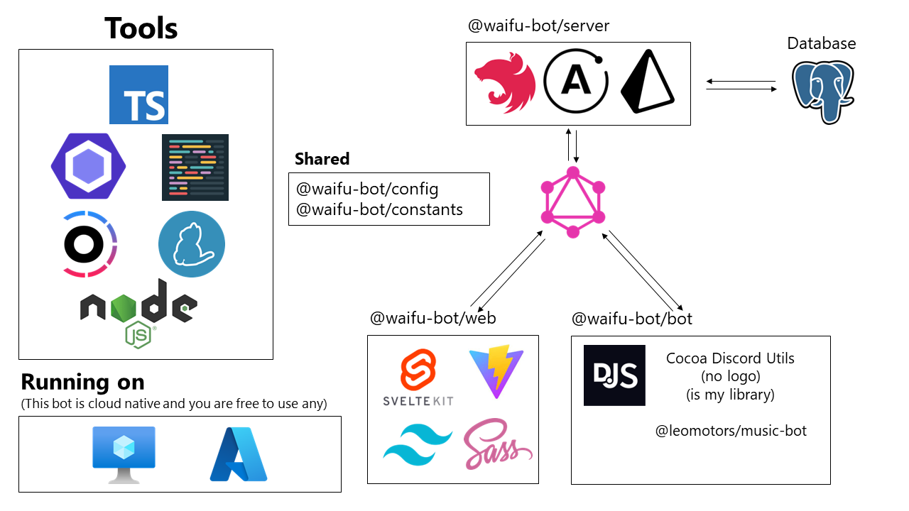

# Waifu Bot

Waifu Bot is the bot that is serving _our_ server

*This branch is for experimental 4.0 preview and is in progress. Visit branch v3.2 for stable version that is currently running on my servers*

**Current Waifu we SIMP**: 式守さん (Shikimori San)  
**Current Version**: 4.0 (IN PROGRESS)  
**Been SIMPing since**: 3.2

## 📚 Tech Stack

The most ~~over-engineered~~ advanced Discord Bot

## ✨ Features

- Mainly: Music from YouTube with power of [@leomotors/music-bot](https://github.com/Leomotors/music-bot#%EF%B8%8F-highlight) << some gallery there

- Personal Playlist for each user with website for them to edit

- Miscellanous ~~useless~~ features

- [Golden Frame](https://github.com/Leomotors/golden-frame)!

- Using Cocoa Discord Utils and 💛JavaScript💛

## 🐇 How to run the bot

### Prerequisites

- Your Discord Bot (of course)
- nodejs (16+ Required, 16 Recommended)
- yarn
- PostgreSQL Database (v12 Recommended) and Public Server (VM) for Website
- Tenor API Key (not required, it works even with invalid key lol)
- [golden-frame](https://github.com/Leomotors/golden-frame) (Installable via pip, required)

### Steps

- Fill in .env (see .env.example in each apps)
- yarn install
- yarn workspace @waifu-bot/server prisma migrate dev
- yarn start (Will start all apps at once, Turborepo will automatically build for you!)

## Waifu Bot Archive

The Discord Bot (apps/bot) was built on top of [CarelessDev/harunon.js](https://github.com/CarelessDev/harunon.js)

**Version 3.0 - 3.1** 雪ノ下陽乃 (Yukinoshita Haruno) [Repository](https://github.com/CarelessDev/harunon.js) <Mar 2022 - July 2022>

**Version 2.0** 雪ノ下陽乃 (Yukinoshita Haruno) But it was in Python [Repository](https://github.com/CarelessDev/Harunon) <November 2021 - Mar 2022>

**Version 1.0** Skittle Chan [Repository](https://github.com/CarelessDev/SIMP-Bot) <Sep 2021 - November 2021>

## Technical Version History

Version 1 $\rarr$ Python Skittle-chan Era  
Version 2 $\rarr$ Python Harunon Era  
Version 3 $\rarr$ JavaScript  
Version 4 $\rarr$ T U R B O R E P O

## Utility Library behind this Bot!

[Cocoa Discord Utils](https://github.com/Leomotors/cocoa-discord-utils) by @Leomotors

**Made with 💛💛💛**
